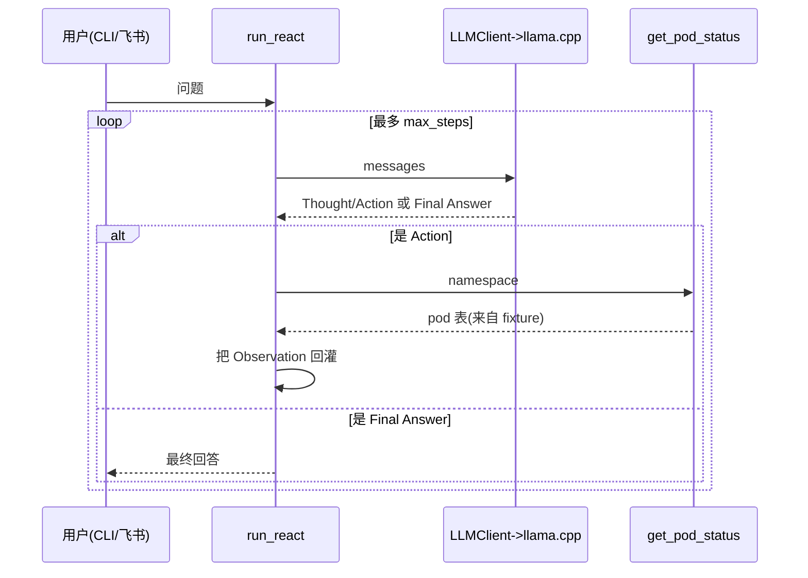

# 阶段 0：地基 + 第一条纵切

## 1. 这阶段做了什么（1 段话 + 1 张流程图）

本阶段打通了 OpsPilot 的第一条端到端纵切：用户从 **CLI**（`opspilot ask`）或**飞书**（WebSocket 长连接 Bot）提一个运维问题，问题进入**手写的 ReAct 循环**（零框架，纯 prompt + 正则解析），循环把消息发给 **OpenAI 兼容的 llama.cpp 推理 server**，按返回的 `Thought / Action / Final Answer` 文本决定是调用 mock 工具 `get_pod_status`（数据来自 `fixtures/kubectl_pods.json` 真实采样）还是直接给出最终答案；工具结果以 `Observation:` 形式回灌成新一轮消息，直到拿到 `Final Answer` 或达到 `max_steps`。整条链路用 `FakeLLM` / `respx` 做了确定性单测覆盖（13 passed），并以单一 `opspilot` 包分层落地，`uv sync` 一键安装。



## 2. 核心原理（面试能被追问的点）

### Q1：什么是 ReAct？为什么工具结果必须以「新一轮消息」回灌，而不是在本地拼字符串就行？

ReAct = **Reasoning + Acting 交替**。LLM 不直接回答，而是先输出 `Thought`（推理），再输出 `Action`/`Action Input`（要调哪个工具、传什么参数）。我们的代码停下来真正执行那个工具，把结果作为 `Observation` **追加成一条新的 `user` 消息**，再把**完整 messages 历史**重新发给模型，让它基于新观察继续推理。

为什么必须回灌成新一轮：LLM 是无状态的，它只能看到这一次请求里 `messages` 的全部内容。工具的真实输出（比如 fixture 里的 pod 表）是模型训练时不存在、也无法臆造的外部事实。只有把 `Observation` 拼回 `messages` 并发起**下一次** completion，模型才能「看到」工具结果并据此收敛到 `Final Answer`。如果只在本地拼字符串而不再请求模型，等于丢掉了「让模型基于观察再推理」这一步，ReAct 就退化成了单次问答。代码里对应的就是循环体末尾的 `messages.append({"role": "user", "content": f"Observation: {observation}"})`，下一轮 `for` 又会把整个 `messages` 发出去。

### Q2：OpenAI 兼容协议（/chat/completions）的请求/响应长什么样？为什么选它而不是各家私有 SDK？

请求是一个 `POST {base_url}/chat/completions`，body 关键字段：

```json
{ "model": "qwen3.5-9b",
  "messages": [{"role": "system", "content": "..."},
               {"role": "user", "content": "..."}],
  "temperature": 0.0 }
```

响应里我们只取一条路径：`resp.json()["choices"][0]["message"]["content"]` —— 即第一个候选回复的文本。鉴权用 `Authorization: Bearer <api_key>`（本地 llama.cpp 用占位 `sk-local` 即可）。

选它的原因：`/chat/completions` 已经是事实标准，llama.cpp、vLLM、各家云服务都实现了同一套契约。面向这个契约编程意味着**换推理后端零代码改动**——本地用 llama.cpp 调试、线上换 vLLM 或云端，只改 `OPSPILOT_LLM_BASE_URL` 一个环境变量。`temperature=0.0` 是刻意的：ReAct 的格式解析依赖模型稳定吐 `Action:` / `Final Answer:`，贪心解码让输出可复现，也让真实联调更接近单测里的确定性行为。

### Q3：为什么手写 ReAct，而不直接上 LangGraph / LangChain？

三个理由：（1）**学习价值**——ReAct 的全部「魔法」就是「prompt 约定格式 + 解析 Action + 执行 + Observation 回灌 + 重发」，手写一遍（`react.py` 仅 ~65 行）能彻底搞懂控制流，面试被追问每一行都答得出；框架会把这套逻辑藏进抽象层，反而说不清。（2）**依赖与可控性**——零框架依赖，循环边界（`max_steps`）、解析正则、错误兜底（未知工具、超步数）全部显式可见、可单测；框架升级 / 行为变更不会突然打穿这条主线。（3）**架构路线**——按 ARCHITECTURE.md 规划，后续阶段才引入更重的编排（Supervisor / plan-execute）。阶段 0 的原则是「一条能跑的细线比任何架构都重要」，先用最小实现验证纵切，再逐块加厚。

### Q4：`SupportsChat` Protocol 是怎么让测试变确定性的？

`run_react` 不依赖具体的 `LLMClient`，而是依赖一个**结构化协议** `SupportsChat`（`async def chat(self, messages) -> str`）。这是 Python 的 **structural typing**：任何带这个签名的对象都能传进去，无需继承。生产环境传真实 `LLMClient`（打 llama.cpp）；测试里传一个 `FakeLLM`——它按预设脚本依次返回 `"Thought:...\nAction: get_pod_status\nAction Input: default"`、`"Final Answer: ..."` 等固定文本。于是整个 ReAct 控制流（调工具→回灌→收敛 / 未知工具兜底 / 超步数兜底）都能在**没有网络、没有模型、完全确定**的条件下断言。`LLMClient` 自己的 HTTP 行为则用 `respx` 把 httpx 请求 mock 成假的 OpenAI 响应单独测。依赖倒置 + Protocol 是这条纵切可测的根本原因。

## 3. 关键代码走读

### `src/opspilot/agent/react.py` —— 手写 ReAct 循环

解决的问题：在不引入任何 Agent 框架的前提下，让无状态 LLM 具备「调工具、看结果、再决策」的能力。它定义 `SYSTEM_PROMPT` 约定输出格式，用三条正则（`_ACTION_RE` / `_ACTION_INPUT_RE` / `_FINAL_RE`）解析模型回复，维护 `messages` 历史；`run_react` 在 `max_steps` 内循环：拿到回复先查 `Final Answer`（命中即返回），否则查 `Action`，从 `TOOLS` 注册表取工具执行，把 `Observation` 回灌为新一轮 `user` 消息。对「未知工具」和「超步数」都有显式兜底返回，控制流全部可见、可单测。

### `src/opspilot/llm/client.py` —— 最小异步 OpenAI 兼容客户端

解决的问题：把「跟推理后端说话」收敛成一个可替换的薄层。`LLMClient.chat` 用 `httpx.AsyncClient` 异步 POST `/chat/completions`，组装标准 OpenAI body（`model` / `messages` / `temperature=0.0`），`raise_for_status()` 后只提取 `choices[0].message.content`。后端地址 / model / key 全部来自注入的 `Settings`，构造函数允许注入自定义 `http_client`（测试用 respx 接管）。它故意不做重试 / 流式 / 多候选——阶段 0 只需要一条能跑且可测的细线。

### `src/opspilot/tools/pod_status.py` —— mock 工具，fixture 驱动

解决的问题：在不接真实 K8s 集群的情况下，给 ReAct 一个返回**真实形态数据**的工具。`get_pod_status(namespace)` 读取 `fixtures/kubectl_pods.json`（真实 `kubectl get pods` 采样），按 namespace 过滤，渲染成 `NAME/READY/STATUS/RESTARTS` 制表符文本——刻意贴近真实 `kubectl` 输出，让模型在 Observation 里看到的就是它将来面对的真实格式。namespace 无匹配时返回友好提示而非抛异常，保证 ReAct 循环不被工具异常打断。

## 4. 如何运行（复制粘贴能跑）

**前置依赖**：已装 [uv](https://docs.astral.sh/uv/)；已编译可用的 llama.cpp（OpenAI 兼容 server）；一个 GGUF 模型权重。

```bash
# 1. 安装依赖（一键，创建 .venv 并锁定）
uv sync

# 2. 另开一个终端，启动本地 llama.cpp（OpenAI 兼容 server，监听 :8080）
#    参数按 ARCHITECTURE.md §2.1；模型/路径换成你本地的 GGUF
./llama-server -m /path/to/Qwen3.5-9B.Q4_K_M.gguf --port 8080

# 3. 回到项目终端，跑 CLI（默认连 http://localhost:8080/v1，见 config.py）
uv run opspilot ask "default 有哪些 pod 不正常"
```

**预期输出**：CLI 打印一段中文最终回答，内容基于 `fixtures/kubectl_pods.json` 里 `default` namespace 的 pod 状态（如哪些 pod 非 `Running` / 重启次数偏高）。

> 若未启动 llama.cpp，CLI 会报 `httpx.ConnectError`（连接 :8080 失败）——这是**预期行为**，ReAct 逻辑本身已被单测覆盖（`FakeLLM` / `respx`），真实联调必须先按本节第 2 步起 server。

**飞书联调（手动验证，不进单测）**：

```bash
# 配置飞书应用凭据（自建应用，开启机器人能力，订阅 im.message.receive_v1，长连接模式）
export OPSPILOT_FEISHU_APP_ID=cli_xxxxxxxx
export OPSPILOT_FEISHU_APP_SECRET=xxxxxxxxxxxxxxxx
# llama.cpp 仍需在 :8080 运行（同上第 2 步）

# 启动飞书 WS 长连接 Bot
uv run python -m opspilot.entrypoints.feishu_ws
```

启动后在飞书里给机器人发一句运维问题（如「default 有哪些 pod 不正常」），机器人会经同一条 ReAct 链路回一条文本消息。`handle_question`（消息处理核心，纯函数）已单测覆盖；`run()` 是手动验证入口。

## 5. 踩坑记录

1. **PowerShell here-string 损坏 commit message**：用 PowerShell 跑 `cat <<'EOF'` heredoc 时，`'` 被转义成字面 `''`，且某次修复又向 subject 注入了 UTF-8 BOM。定位手段：`git show -s --format=%B` 看消息体 + 原始字节 `xxd` 看首字节。根因：PowerShell 不解析 bash 的 heredoc 语法。解决：所有提交改用 Git Bash `bash -c '...'` 执行，并在每次提交后做字节校验（首字节必须是命令名、不能出现 `EF BB BF` BOM）。

2. **Typer 0.25.1 单命令折叠**：计划里 `cli.py` 的 verbatim 代码没有 `@app.callback()`，但 Typer 0.25.1 在只有一个命令时会自动「折叠」子命令，于是 `runner.invoke(app, ["ask", "..."])` 退出码 2，报 `Got unexpected extra argument`。根因：单命令 app 把 `ask` 当成了 question 位置参数。解决：加一个最小 no-op `@app.callback()` `_root()`（Typer 官方机制，强制保留显式子命令名），测试不动。

3. **lark-oapi 1.6.5 无类型 stubs + Optional 偏多**：pyright strict 对 `lark_oapi` 报 7 个 Optional 属性访问错误 + 缺 type stubs。解决：在 `feishu_ws.py` 顶部加文件局部 `# pyright: reportMissingTypeStubs=false`；对 `_extract_text` / `run()`（均为手动验证代码）加最小 `None` 守卫；`handle_question` 与其测试保持 verbatim 不动，确保被测核心逻辑不被「为过类型检查」而改写。

4. **earlier tasks 只跑了 ruff check 没跑 ruff format**：前面任务里 verbatim 代码的换行 / 引号风格不统一，导致 6 个文件 `ruff format --check` 失败。解决：按计划 Task 6 Step 5 的授权，跑一次仓库级 `uv run ruff format .` 作为独立的 `style:` 提交（`a61e401`，纯格式化、零逻辑变更），提交后四道门禁复跑全绿。

5. **本地 llama.cpp 未启动**：CLI / 飞书手动 smoke 报 `ConnectError` / 连接失败。根因：开发机没有跑 :8080 推理 server。属预期——业务逻辑已被单测覆盖（`FakeLLM` / `respx`），真实联调需先按 ARCHITECTURE.md §2.1 启动 llama.cpp。

## 6. 验收自检

逐条对照阶段 0 验收标准，附命令与结果证据：

- ✅ **CLI `opspilot ask` 跑通手写 ReAct，基于 fixture 回答**
  证据：`uv run pytest -v` 中 `tests/test_cli.py::test_cli_ask_outputs_answer PASSED`、`tests/test_react.py` 3 项全 PASSED、`tests/test_pod_status.py` 3 项全 PASSED。llama.cpp 未启动时手动 smoke 报连接错误属预期（见踩坑 5）。

- ✅ **飞书 WS 入口：`handle_question` 单测通过；`run()` 手动联调说明**
  证据：`tests/test_feishu_ws.py::test_handle_question_delegates_and_trims PASSED`、`test_handle_question_rejects_empty PASSED`；`run()` 联调步骤见本文 §4「飞书联调」。

- ✅ **单一 `opspilot` 包，分层清晰，`uv sync` 一键装**
  证据：`src/opspilot/` 下 `agent/` `llm/` `tools/` `entrypoints/` `config.py` 分层；`uv sync` 一键创建 `.venv` 并锁定依赖（见 §4 步骤 1）。

- ✅ **全套质量门禁绿：ruff check / ruff format --check / pyright(0) / pytest(13)**
  证据（本任务 Step 3 实跑）：
  - `uv run pytest -v` → `13 passed, 2 warnings in 6.08s`（13/13 全 PASSED）
  - `uv run ruff check .` → `All checks passed!`
  - `uv run ruff format --check .` → `18 files already formatted`
  - `uv run pyright` → `0 errors, 0 warnings, 0 informations`

- ✅ **`docs/stages/stage0_foundation.md` 含 Mermaid 流程图 + 原理 + 运行说明 + 踩坑**
  证据：即本文件，§1 含 ReAct 时序 Mermaid 图，§2 含 4 个面试问答，§3 关键代码走读，§4 复制粘贴可跑，§5 踩坑记录。

- ✅ **每个 Task 一个语义化、带 body 的详细 commit；阶段末打 `stage0` tag**
  证据：`git log --oneline` 显示 `chore(stage0) bootstrap` → `feat(tools)` → `feat(config)` → `feat(llm)` → `feat(agent)` → `feat(cli)` → `feat(feishu)` → `style(stage0)` 共 8 个语义化提交（均带 body）；本任务末尾 `git tag -a stage0` 完成阶段标记。
