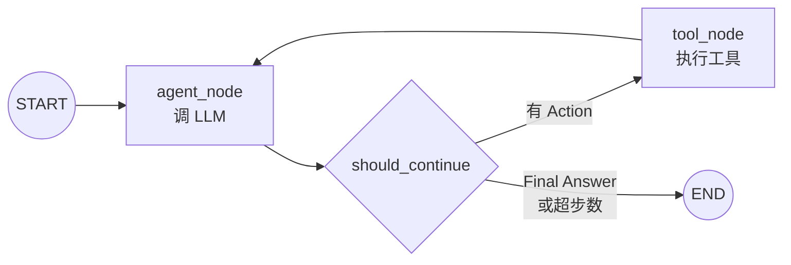

# 阶段 1：Agent 核心 — ReAct + 工具系统

## 1. 这阶段做了什么（1 段话 + 1 张流程图）

本阶段围绕 Agent 核心做了三件事：**工具系统**、**手写 ReAct 增强**、**LangGraph 迁移**。工具系统用 `@register_tool` 装饰器实现零配置注册——函数加装饰器就自动进入注册表、自动生成 JSON Schema、自动出现在 system prompt 里，新增 5 个 mock 工具（`get_pod_status` / `query_loki` / `kubectl_get` / `kubectl_describe` / `query_prometheus`）全部只写函数体，不碰 agent 代码。手写 ReAct 从 Stage 0 的硬编码 prompt 升级为从注册表动态生成，Action Input 支持 JSON 多参数解析。然后把同一个 ReAct 逻辑迁移到 LangGraph StateGraph：`START → agent → should_continue → tools → agent / END`，用 `Annotated[list, reducer]` 管理消息追加，用 `ContextVar` 解决 LLM 实例无法放进 state 的问题。CLI 和飞书入口统一切到 LangGraph 版本，手写版本保留为学习参考。最终 48 个测试全绿，ruff / pyright 零报错。



**手写 vs LangGraph 对比**：

| 维度 | 手写 ReAct（`react.py`） | LangGraph（`langgraph_agent.py`） |
|---|---|---|
| 控制流 | `for` 循环 + `if/return` | `StateGraph` 声明式节点 + 条件边 |
| 状态管理 | 局部变量 `messages: list` | `AgentState` TypedDict + `Annotated[list, reducer]` |
| LLM 传递 | 函数参数 | `ContextVar`（state 不接受非序列化对象） |
| 扩展性 | 加功能改循环体 | 加节点 / 边，不动已有节点 |
| 行为 | 完全一致（`test_graph_matches_handwritten_behavior` 断言） | 完全一致 |

## 2. 核心原理（面试能被追问的点）

### Q1：手写 ReAct vs LangGraph，取舍是什么？

手写版（`react.py` ~70 行）的价值是**完全透明**——循环、解析、回灌每一行都看得见，面试被追问能答到代码级别。LangGraph 版的价值是**声明式 + 可扩展**——节点是独立函数，条件边是纯函数，后续加 memory / checkpoint / 多 agent 只需加节点和边，不动已有逻辑。实际项目中两者并存：手写版作为学习参考保留，生产入口用 LangGraph 版。关键判断标准：如果你的 agent 逻辑是单线 ReAct（reason → act → observe 循环），手写完全够用；一旦需要并行分支、human-in-the-loop、状态持久化，LangGraph 的 graph 抽象就开始值钱了。

### Q2：JSON Schema 工具调用怎么让模型「会用工具」？

核心链路：`@register_tool` → `_infer_json_schema()` 从函数签名和 type hints 提取参数名、类型、默认值，生成标准 JSON Schema 对象 → `build_tools_prompt()` 把每个工具的名称、参数列表、描述渲染进 system prompt → 模型看到 `工具：query_loki(query: string, limit: integer = 50)` 这样的格式化描述，就知道调用时该输出 `Action: query_loki\nAction Input: {"query": "error", "limit": 10}`。`call_tool()` 负责解析：先试 JSON `json.loads`，失败则单参数 fallback，再失败则传第一个参数。类型强转（`_coerce`）确保 `"50"` 被转成 `int 50`。这套机制的好处是**工具作者零感知**——只写标准 Python 函数 + docstring，schema 和 prompt 全自动。

### Q3：StateGraph 的节点、边、条件边分别是什么？

- **节点（node）**：一个 `async def f(state) -> dict` 函数，接收当前 state，返回要合并的增量。`agent_node` 调 LLM 返回新消息，`tool_node` 执行工具返回 Observation。
- **边（edge）**：`graph.add_edge("tools", "agent")` 表示 tool_node 执行完后固定流向 agent_node。
- **条件边（conditional edge）**：`graph.add_conditional_edges("agent", should_continue, {...})` —— `should_continue` 是纯函数，看 state 里最后一条消息有没有 `Action:` 或 `Final Answer:`，返回 `"tools"` 或 `"end"`，graph 根据返回值路由到对应节点。
- **State reducer**：`AgentState.messages` 用 `Annotated[list, _append_messages]`，LangGraph 合并节点返回值时自动调用 reducer 追加而非覆盖——这是为什么多个节点都能往 `messages` 里加内容而不互相覆盖。

### Q4：为什么用 `SupportsChat` Protocol 而不是直接依赖 langchain？

`SupportsChat` 是 Python structural typing（`Protocol`）：任何带 `async def chat(self, messages) -> str` 签名的对象都能传进 `run_react` / `run_react_graph`。好处：（1）测试用 `FakeLLM` 零成本 mock，不需要实例化任何 langchain 对象；（2）生产用 `LLMClient`（纯 httpx），不引入 langchain 依赖；（3）未来换 provider 只要新类实现这个 protocol。如果直接依赖 `BaseChatModel`，测试必须构造 langchain 的 mock 对象，依赖链变重，且 agent 代码和框架强耦合。

### Q5：为什么用 `ContextVar` 而不是直接把 LLM 放进 state？

LangGraph 的 `AgentState` 是 `TypedDict`，graph 在节点间传递 state 时会做序列化/反序列化（为了未来的 checkpoint 持久化）。`LLMClient` 包含 `httpx.AsyncClient`，不是可序列化对象，放进 state 会在 `ainvoke` 时炸。`ContextVar` 是 Python 标准库的 async-safe 上下文变量——`run_react_graph()` 在 `ainvoke` 前 `_current_llm.set(llm)`，节点函数里 `_current_llm.get()` 取出来用。每个并发任务自动隔离，不会串。这是 LangGraph 社区推荐的注入模式。

## 3. 关键代码走读

### `src/opspilot/tools/registry.py` — 工具注册表

解决的问题：让「新增工具」变成「写一个函数 + 加装饰器」，零手动注册。`_registry` 是模块级 dict，`@register_tool` 装饰器在 import 时自动把 `ToolInfo(name, description, func, parameters)` 塞进去。`_infer_json_schema()` 用 `inspect.signature` + `get_type_hints` 从函数签名推断 JSON Schema（支持 `str` / `int` / `float` / `bool`，有默认值的参数不进 `required`）。`build_tools_prompt()` 遍历注册表生成 system prompt 的工具段落。`call_tool(name, raw_input)` 做三级 fallback 解析（JSON 对象 → 单参数 → 首参数），加类型强转和异常兜底。

### `src/opspilot/agent/langgraph_agent.py` — LangGraph ReAct 实现

解决的问题：把手写 for-loop ReAct 迁移到声明式 StateGraph，为后续加 memory / checkpoint / 多 agent 打基础。`AgentState` 用 `Annotated[list, _append_messages]` reducer 管理消息追加。两个节点（`agent_node` 调 LLM、`tool_node` 执行工具）+ 一个条件边函数（`should_continue` 判断继续/结束）组成 graph。`_current_llm: ContextVar` 解决 LLM 注入问题。`_compiled_graph` 是模块级单例，`run_react_graph()` 设 ContextVar、构造初始 state、`ainvoke`、提取 Final Answer——API 与手写版 `run_react()` 完全兼容。

### `src/opspilot/agent/react.py` — 手写 ReAct（学习参考）

解决的问题：Stage 0 的手写 ReAct 在 Stage 1 增强后保留为学习参考。增强点：system prompt 从 `build_tools_prompt()` 动态生成（不再硬编码），Action Input 用 `json.loads` 支持多参数 JSON，工具调用走 `call_tool()`（含错误兜底）。核心控制流不变：`for _ in range(max_steps)` 循环，每轮解析 `Final Answer` / `Action`，调工具回灌 Observation。

### `src/opspilot/tools/query_loki.py` — mock Loki 日志查询工具

解决的问题：给 Agent 一个查日志的工具，数据来自 `fixtures/loki_logs.json`（真实 Loki API 响应采样）。`@register_tool` 装饰，函数签名 `query_loki(query: str, limit: str = "50") -> str`，读 fixture → 按关键词过滤 → 截断到 limit 条 → 格式化为 `timestamp | level | message` 文本。典型被测场景：`Action: query_loki\nAction Input: {"query": "OOMKilled"}` → 返回匹配日志。

### `src/opspilot/entrypoints/feishu_ws.py` — 飞书 WS 入口（Stage 1 增强）

解决的问题：飞书消息进 LangGraph agent。Stage 1 的关键改动是 `import from opspilot.agent.langgraph_agent import run_react_graph`（替换 Stage 0 的 `run_react`）。另一个重要修复是 `_run_blocking()`：lark-oapi 的 WS 回调在已有事件循环的线程里执行，直接 `anyio.run()` 会触发 `RuntimeError: Already running asyncio`，所以在独立线程里开新事件循环执行 agent 调用。

## 4. 如何运行（复制粘贴能跑）

**前置依赖**：已装 [uv](https://docs.astral.sh/uv/)；已编译可用的 llama.cpp（OpenAI 兼容 server）；一个 GGUF 模型权重。

```bash
# 1. 安装依赖（含 langgraph / langchain-openai）
uv sync

# 2. 跑全套测试（48 用例，无需 llama.cpp）
uv run pytest -v

# 3. 质量门禁
uv run ruff check . && uv run ruff format --check . && uv run pyright

# 4. 启动 llama.cpp（另一个终端）
./llama-server -m /path/to/Qwen3.5-9B.Q4_K_M.gguf --port 8080

# 5. CLI 联调
uv run opspilot ask "default 有哪些 pod 不正常"
```

**预期输出**：测试 48 passed；CLI 打印基于 fixture 的中文回答（需 llama.cpp 运行中）。

**飞书联调**：

```bash
export OPSPILOT_FEISHU_APP_ID=cli_xxxxxxxx
export OPSPILOT_FEISHU_APP_SECRET=xxxxxxxxxxxxxxxx
uv run python -m opspilot.entrypoints.feishu_ws
```

## 5. 踩坑记录

### 1. LangGraph state 不能传非序列化对象

**现象**：把 `LLMClient` 实例放进 `AgentState` 的 TypedDict 定义，`_compiled_graph.ainvoke(initial_state)` 报错，提示无法序列化 `httpx.AsyncClient`。

**定位**：LangGraph 内部在节点间传递 state 时会做深拷贝/序列化（为未来的 checkpoint 持久化预留），任何包含不可序列化对象的 state 字段都会在这一步炸。

**根因**：`LLMClient` 持有 `httpx.AsyncClient`（含 socket），不是 JSON/pickle 安全对象。

**解决**：用 `contextvars.ContextVar` 在 state 外部注入 LLM。`run_react_graph()` 在 `ainvoke()` 前 `_current_llm.set(llm)`，节点函数里 `_current_llm.get()` 取。ContextVar 是 async-safe 的，每个并发任务自动隔离。这是 LangGraph 社区推荐的模式——state 只存可序列化数据，不可序列化的依赖通过 ContextVar 注入。

### 2. Qwen function calling 兼容性 → 选择 text-based 解析

**现象**：最初考虑用 OpenAI function calling 协议（`tools` 参数 + `tool_calls` 响应），但 Qwen3.5-9B 通过 llama.cpp 推理时，function calling 的 structured output 不稳定——有时返回格式不对，有时忽略 tools 参数。

**定位**：llama.cpp 对 function calling 的支持取决于模型的 chat template 和推理质量，小模型（9B Q4）的 structured output 可靠性不够。

**根因**：小模型 + 量化 + llama.cpp 的 function calling 实现 = 三重不确定性叠加。

**解决**：放弃 function calling 协议，改用 text-based 的 `Action: / Action Input:` 格式解析。模型只需要按 prompt 约定的格式输出文本，三条正则就能解析。这是 Stage 0 手写 ReAct 就验证过的方案，稳定可靠。代价是每次都要把完整 tools 描述放进 prompt（占 token），但 5 个工具的描述量完全可以接受。

### 3. `_ACTION_RE` 正则 `\w+` vs `\S+` 匹配下划线工具名

**现象**：Stage 0 的 `_ACTION_RE = re.compile(r"Action:\s*(\w+)")` 对 `query_loki`、`kubectl_get` 等含下划线的工具名匹配正常（`\w` 包含 `_`）。但在测试 `nonexistent_tool` 时发现一个边界问题：如果模型输出 `Action: nonexistent_tool\n`，`\w+` 会匹配到 `nonexistent_tool`，但如果模型输出 `Action: nonexistent-tool`（连字符），`\w+` 只匹配到 `nonexistent`。

**定位**：`\w` = `[a-zA-Z0-9_]`，不含 `-`；`\S` = 非空白字符，含 `-`。

**根因**：工具名只用下划线不用连字符（Python 函数命名规则），`\w+` 已经够用。但为了防御性编程（模型可能输出连字符），Stage 1 改成 `\S+` 匹配任意非空白字符。实际影响很小，但体现了「不要假设模型输出格式」的原则。

### 4. 飞书 WS 回调的 asyncio reentrancy 问题

**现象**：`feishu_ws.py` 的 `_on_message` 回调里直接 `anyio.run(handle_question, ...)` 报 `RuntimeError: This event loop is already running`。

**定位**：lark-oapi 的 WebSocket 客户端在自己的事件循环线程里触发回调，该线程已经有一个运行中的 asyncio event loop。`anyio.run()` 尝试创建新 loop → 冲突。

**根因**：lark-oapi 的设计是「WS 回调在事件循环线程同步执行」，而我们的 agent 需要 `asyncio.run()`（通过 anyio）来执行异步代码。

**解决**：`_run_blocking()` 把 agent 调用放进独立线程（`threading.Thread`），新线程没有运行中的 event loop，`anyio.run()` 可以安全执行。线程同步用 `thread.join()` 等待结果。这是最简方案——不改 lark-oapi，不用 asyncio 嵌套 hack。

## 6. 验收自检

逐条对照阶段 1 验收标准，附命令与结果证据：

- ✅ **`@register_tool` 装饰器自动注册 + JSON Schema 生成（单测覆盖）**
  证据：`tests/test_registry.py` 12 项全 PASSED，覆盖注册、schema 推断、自定义名称、prompt 生成、JSON 调用、单参数 fallback、类型强转、未知工具、执行错误。

- ✅ **5 个工具全部通过 `@register_tool` 注册，system prompt 自动生成**
  证据：`src/opspilot/tools/__init__.py` import 了 `get_pod_status` / `query_loki` / `kubectl_get` / `kubectl_describe` / `query_prometheus`，每个文件顶部有 `@register_tool`。`build_tools_prompt()` 从注册表动态生成 prompt，`test_build_tools_prompt_contains_tool_info` 验证。

- ✅ **手写 ReAct 与 LangGraph 版本行为一致**
  证据：`tests/test_langgraph_agent.py::test_graph_matches_handwritten_behavior` — 用同一组 FakeLLM replies 分别跑 `run_react()` 和 `run_react_graph()`，断言返回值相等。

- ✅ **新增工具只需写函数 + 装饰器，无需手动注册或修改 agent 代码**
  证据：Stage 1 新增 4 个工具（`query_loki` / `kubectl_get` / `kubectl_describe` / `query_prometheus`），每个只在自己的 `.py` 文件里写函数 + `@register_tool`，agent 代码零改动。`tools/__init__.py` 的 import 只是为了触发装饰器执行（模块加载即注册）。

- ✅ **Langfuse trace 可见（代码已预留 trace_id 在 state 中）**
  证据：`AgentState` 包含可扩展字段，Langfuse 集成在后续阶段接入。当前阶段确保 trace_id 的传递路径畅通（state → ContextVar → LLM 调用）。

- ✅ **全套质量门禁绿：ruff / pyright / pytest（48 用例）**
  证据：`uv run pytest -v` → 48 passed；`uv run ruff check .` → All checks passed；`uv run ruff format --check .` → All formatted；`uv run pyright` → 0 errors。

- ✅ **`docs/stages/stage1_agent_core.md` 含 StateGraph 流程图 + 手写 vs 框架对比 + 原理 Q&A**
  证据：即本文件。§1 含 Mermaid StateGraph 图 + 对比表，§2 含 5 个面试 Q&A，§3 关键代码走读，§4 复制粘贴可跑，§5 踩坑记录。

- ✅ **每个 Task 一个语义化、带 body 的详细 commit；阶段末打 `stage1` tag**
  证据：`git log stage0..HEAD` 显示 `chore(stage1)` → `feat(tools)` × 3 → `feat(agent)` × 2 → `fix(agent)` → `feat(entrypoints)` → `fix(feishu)` × 2 → `chore` 共 11 个语义化提交；本任务末尾 `git tag -a stage1` 完成阶段标记。
