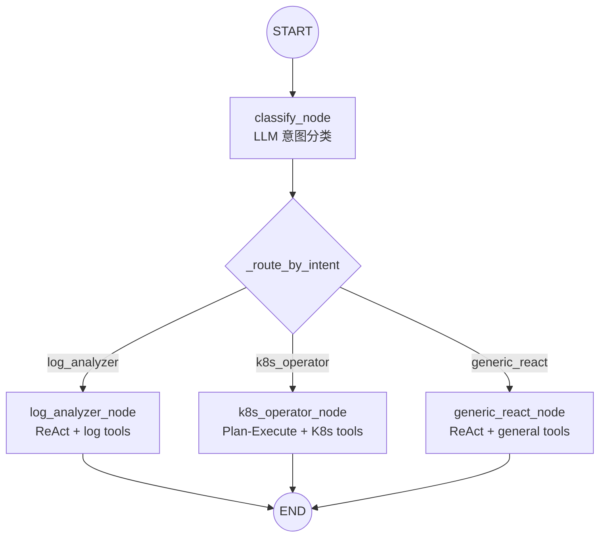
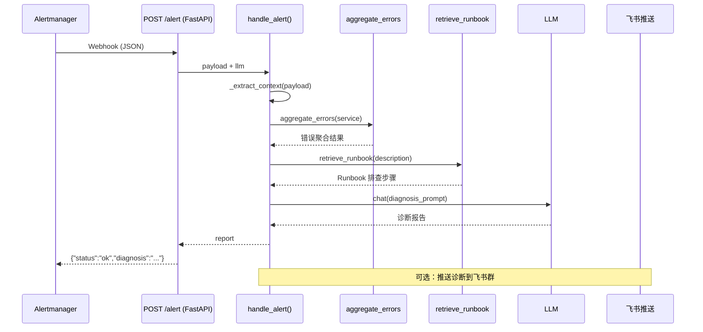

# 阶段 3：多智能体 Supervisor + Alert Handler + 飞书卡片确认

## 1. 这阶段做了什么（1 段话 + 流程图）

本阶段把 Stage 2 的单 Agent（ReAct 或 Plan-Execute 二选一）升级为**多智能体协作系统**。六块核心工作：

1. **Supervisor StateGraph**：classify 节点用 LLM 做意图分类（log_analyzer / k8s_operator / generic_react），条件边路由到对应子 Agent 节点。每个子 Agent 是独立编译的 LangGraph 图，接收过滤后的工具 prompt。
2. **Per-Agent Tool Scoping**：`build_tools_prompt(tool_filter)` 让每个子 Agent 只看自己的工具。Log Analyzer 看不到 kubectl_scale，K8s Operator 看不到 aggregate_errors。通过 `tool_filter` 参数显式传递，无模块级 patch，并发安全。
3. **Alert Handler 诊断管道**：Alertmanager webhook → `_extract_context` 解析 → `aggregate_errors` 查日志 + `retrieve_runbook` 取 Runbook → LLM 综合诊断 → 返回报告。
4. **飞书交互卡片确认**：危险操作触发 `build_confirm_card()` → 飞书推送卡片 → 用户点击确认/取消 → 卡片回调 `consume_confirmation()` 消费状态。进程内 dict + threading.Lock 管理状态（Stage 6 可迁 Postgres）。
5. **retrieve_runbook Stub**：fixture JSON 关键词匹配。`_load_runbooks()` 从 `fixtures/runbook_*.json` 加载，按关键词交集评分选最佳 Runbook。Stage 4 替换为 Qdrant RAG。
6. **Eval 15 cases**：新增 5 条 Stage 3 case（Supervisor 路由、fallback、Runbook 检索、告警诊断），harness 更新为 15 cases。

### Supervisor 路由图



### 告警处理全链路时序



## 2. 核心原理（面试能被追问的点）

### Q1：单 Agent vs 多 Agent，什么时候该拆？

**单 Agent（Stage 1/2）** 用同一套 system prompt + 全量工具，模型需要在每次 Action 决策时从所有工具中筛选。当工具数 < 10 时够用，但工具增多后有两个问题：（1）prompt 长度膨胀，工具描述占 token 预算；（2）模型容易选错工具（比如查日志却调了 kubectl_scale）。

**多 Agent（Stage 3）** 把"选工具"的决策前置为"意图分类 + 按角色给工具"。Supervisor 只做一次分类（classify_node），然后每个子 Agent 只看到自己领域的 3-5 个工具——工具列表短、专注、不容易选错。

**拆分标准**：按职责边界（不是按技术层）。Log Analyzer 和 K8s Operator 是两个职责——前者读日志/指标，后者读写 K8s 资源。如果按"读工具 Agent + 写工具 Agent"拆，虽然技术层清晰但职责模糊（查 pod 状态是读还是写？）。按"查日志的人" vs "管 K8s 的人"拆，边界更自然。

### Q2：Supervisor 路由设计 — 为什么用 LLM 分类而不是正则/关键词？

**关键词匹配的问题**：运维问题表达多变。"查日志"、"看下错误"、"有没有报错"、"最近出什么问题了"——同是 log_analyzer 意图，但关键词不重叠。正则匹配需要持续维护关键词库，且无法区分"查 order-service 的日志"（log_analyzer）和"查 order-service 有几个 pod"（k8s_operator）。

**LLM 分类**用一条分类 prompt + 正则提取 `INTENT: <类别>`，代码量 ~10 行，准确率高且零维护成本。Fallback 设计：如果 LLM 返回格式不符合预期（`_INTENT_RE` 不匹配），默认走 `generic_react`——所以不会因分类失败而拒绝回答。

**代价**：多一次 LLM 调用（classify 约 0.3-1s），但对于运维对话场景（用户主动提问），这个延迟可接受。

### Q3：为什么用飞书交互卡片确认而非纯文本确认？

**纯文本确认**（"回复 Y 确认"）有两个问题：（1）用户可能回无关的消息（"稍等"、"再想想"），需要处理模糊匹配；（2）无法做结构化状态管理——不知道用户是确认了哪个操作、参数是什么。

**飞书交互卡片**把"确认"变成 UI 操作——确认/取消按钮的 `value` 字段携带结构化数据（`{"action":"confirm","tool":"kubectl_scale","input":"..."}`）。卡片回调到达时，`consume_confirmation(chat_id)` 一次性消费状态，没有模糊匹配问题，不需要解析用户自由文本。

**安全默认**：`consume_confirmation` 的默认返回值是 `False`（`context.get("confirmed", False)`）。只有卡片回调明确设置了 `confirmed=True` 时才会执行——宁可误拦截也不误执行。

### Q4：handoff 状态传递 — 子 Agent 间如何通信？

当前（Stage 3）每个子 Agent 节点内调 `run_react_graph()` 或 `run_plan_execute()`，子 Agent 是完全独立的执行——接收 `question`，返回 `final_answer`。子 Agent 之间不直接通信；Supervisor 在同一轮 `ainvoke` 内只走一个子 Agent。

**工具集隔离**通过 `tool_filter` 参数实现：`run_react_graph(question, llm, tool_filter=_LOG_ANALYZER_TOOLS)` → 内部调 `build_tools_prompt(tool_filter=tool_filter)` → 只生成过滤后的工具列表。`tool_filter` 通过 ContextVar 在 Plan-Execute 的 executor_node 中也能访问，保证子图内各节点用的都是同一套工具。

## 3. 关键代码走读

### `src/opspilot/agent/supervisor.py` — Supervisor StateGraph

解决的问题：把"意图分类 + 路由"编排成 LangGraph StateGraph。`SupervisorState` 只有三个字段：`question`（用户原始问题）、`intent`（分类结果）、`final_answer`（子 Agent 输出）。

`classify_node` 构造一条分类 prompt（含三类意图定义 + 用户消息），调 LLM 后用 `_INTENT_RE` 正则提取意图。返回 `{"intent": "log_analyzer"}` 等，由 `_route_by_intent` 条件边路由到对应子节点。

三个子 Agent 节点（`log_analyzer_node`、`k8s_operator_node`、`generic_react_node`）都是对 `run_react_graph()` / `run_plan_execute()` 的薄封装，传入不同的 `tool_filter` set。`run_supervisor()` 入口函数 API 与 `run_react_graph()` 完全兼容——`(question, llm)` 签名，用 `ContextVar` 注入 LLM。

### `src/opspilot/agent/alert_handler.py` — 告警诊断管道

解决的问题：接收 Alertmanager webhook JSON，输出结构化诊断报告。

`_extract_context(payload)` 从 Alertmanager v4 格式中提取 service/namespace/alertname/severity 等关键字段。`handle_alert(payload, llm)` 主流程：（1）`aggregate_errors(service, namespace)` 获取日志聚合；（2）`retrieve_runbook(description)` 获取 Runbook；（3）组装 diagnosis_prompt 调 LLM 综合诊断；（4）返回带【OpsPilot 告警诊断报告】头的完整报告。

设计要点：（1）`handle_alert` 不依赖 FastAPI——纯函数，可直接单测传入 FakeLLM；（2）`aggregate_errors` 和 `retrieve_runbook` 是同步函数，在 async context 中直接调用；（3）错误不抛给调用方——webhook 层有 try/except 兜底。

### `src/opspilot/entrypoints/feishu_card.py` — 飞书交互卡片

解决的问题：危险操作前推卡片让用户二次确认，确认后才能执行。

`build_confirm_card(tool_name, tool_input)` 返回 Feishu 卡片 JSON——红头标题 + markdown 操作描述 + 确认/取消两个按钮。按钮 value 是 JSON 字符串，携带 action/tool/input。

`register_pending(chat_id, context)` 和 `consume_confirmation(chat_id)` 管理待确认状态。`_lock` (threading.Lock) 保证并发安全。`consume_confirmation` 用 `dict.pop()` 一次性消费（确认过就不能再确认第二次）。安全默认：`context.get("confirmed", False)` → 只有明确设置 `confirmed=True` 才通过。

### `src/opspilot/tools/runbook.py` — retrieve_runbook Stub

解决的问题：根据故障描述检索匹配的 Runbook。当前（Stage 3）用 fixture JSON 关键词匹配做 stub，Stage 4 替换为 Qdrant 向量检索。

`_load_runbooks()` 缓存式加载 `fixtures/runbook_*.json`。`retrieve_runbook(query)` 遍历 Runbook，按关键词交集计分，返回最佳匹配的完整排查步骤。无匹配时返回通用排查步骤（6 步）。

### `src/opspilot/tools/log_tools.py` — 日志分析工具

`aggregate_errors(service, namespace)` 返回按错误类型分组的 mock 数据，`tail_pod_logs(pod_name, namespace, tail_lines)` 返回 mock pod 日志。两者都是 `@register_tool` 注册，通过 `build_tools_prompt` 自动生成工具提示。Stage 3 用 mock 数据，Stage 5 可替换为真实 Loki/kubectl 调用。

## 4. 如何运行（复制粘贴能跑）

**前置依赖**：已装 [uv](https://docs.astral.sh/uv/)；已编译可用的 llama.cpp（OpenAI 兼容 server）；一个 GGUF 模型权重。

```bash
# 1. 安装依赖
uv sync

# 2. 跑全套测试（无需 llama.cpp，CI 友好）
uv run pytest -q
# 预期：104 passed, 1 skipped

# 3. 质量门禁
uv run ruff check . && uv run ruff format --check .

# 4. 最小 Eval（15-case 分数表，无需 llama.cpp）
uv run python scripts/run_eval.py
# 预期：TOTAL: 15/15 passed

# 5. Supervisor 联调（需 llama.cpp 运行中）
uv run opspilot ask "查一下 user-service 的错误日志"
# 走 Supervisor → classify → log_analyzer → ReAct

# 6. Plan-Execute 直接路径（跳过 Supervisor）
uv run opspilot ask "规划：重启 order-service" --plan

# 7. Alert Handler HTTP 端点
uv run uvicorn opspilot.entrypoints.alert_webhook:app --port 8000
curl -X POST http://localhost:8000/alert \
  -H "Content-Type: application/json" \
  -d @fixtures/alertmanager_webhook.json

# 8. 飞书 Bot 入口（需要飞书 App 凭据配置在 .env 中）
# uv run opspilot feishu
```

## 5. 踩坑记录

### 1. Tool Filter 并发安全问题（lambda patch → 参数传递）

**现象**：最初 Supervisor 子 Agent 节点用 `import opspilot.tools.registry as reg; reg.build_tools_prompt = lambda: original(tool_filter=...)` 做模块级 patch。单测跑没问题，但并发场景下两个请求同时打 patch 会互相覆盖对方的 tool_filter。

**根因**：模块级 monkey-patching 不是 async-safe 的——两个协程在不同阶段执行 `build_tools_prompt`，拿到的是对方设置的 tool_filter。

**解决**：改为显式参数传递。`run_react_graph()` 和 `run_plan_execute()` 新增 `tool_filter` 参数，内部直接传 `build_tools_prompt(tool_filter=tool_filter)`。`plan_execute.py` 用 `_pe_tool_filter` ContextVar 让 executor_node（同步函数，无法接收参数）也能访问 tool_filter。**教训**：永远不要用模块级 monkey-patching 解决 async context 中的参数传递问题——ContextVar 或显式参数才是正道。

### 2. Git amend 灾难：amend 中间 commit 导致后续 commit 合并

**现象**：Task 4 写完 Task 5 后，amend Task 4 的 commit。`git commit --amend` 把 Task 5 的改动也吞进了 Task 4 commit，然后 Task 5 是一个空 commit（只移动了 HEAD）。执行 `git reset --soft` 回退 + 重提交才恢复。

**根因**：amend 只能用于 HEAD commit。如果已经 push 或后续 commit 基于该 commit，amend 会破坏历史。

**解决**：用 `git reflog` 找回原 commit（7af93de Task 5, b3ca2f3 Task 4），`git reset --soft d37ea2e` 回退到分叉点，按正确顺序重提交。

**教训**：多 commit 链中修改中间 commit 用 `git rebase -i`，不要用 amend。amend 只用于刚提交、未 push、后续无 commit 的场景。

### 3. Eval case 的 scripted_replies 不能包含 INTENT 行

**现象**：最初 Stage 3 eval case 的 `scripted_replies[0]` 是 `"INTENT: log_analyzer"`，但 eval harness 使用 `run_react_graph()`（不是 Supervisor）跑 case，ReAct 解析器不认识 INTENT 格式。

**根因**：eval harness 的设计是直接测试工具调用正确性（底层），不是测试 Supervisor 路由（顶层）。Supervisor 路由在 `test_supervisor.py` 里独立测试。

**解决**：去掉 scripted_replies 中的 INTENT 行，让 ReAct 直接从 Action/Final Answer 开始。

### 4. `consume_confirmation` 默认值必须为 False（安全第一）

**现象**：计划中 `consume_confirmation` 返回 `context.get("confirmed", False)`，但实现时误写为 `True`。这意味着注册后未设置 `confirmed` 字段的 context 会被当作"已确认"。

**根因**：手误。但从安全模型看——危险操作拦截的默认必须是"拒绝"（deny-by-default），不是"允许"（allow-by-default）。

**解决**：改为 `False`，测试中的 `register_pending` 调用显式传入 `"confirmed": True`。

## 6. 验收自检

逐条对照阶段 3 验收标准，附命令与结果证据：

- ✅ **Supervisor 按意图正确路由到子 Agent**
  证据：`tests/test_supervisor.py` 3 项全 PASSED（log_analyzer / k8s_operator / fallback）。`uv run pytest tests/test_supervisor.py -q` → 3 passed。

- ✅ **Log Analyzer Agent 使用 ReAct 处理日志查询**
  证据：`tests/test_log_tools.py` 4 passed（aggregate_errors + tail_pod_logs）。

- ✅ **K8s Operator Agent 使用 Plan-Execute 处理 K8s 操作**
  证据：`tests/test_supervisor.py::test_supervisor_routes_k8s_query_to_k8s_operator` → PASSED。Plan-Execute 已有 Stage 2 测试全覆盖。

- ✅ **Alert Handler 接收 webhook → 调 log tools + retrieve_runbook → LLM 诊断**
  证据：`tests/test_alert_handler.py` 2 passed（含 monkeypatch 验证 Runbook 被调用）。`tests/test_alert_webhook.py` 2 passed（FastAPI endpoint）。

- ✅ **retrieve_runbook stub 通过 fixture 关键词匹配返回 Runbook**
  证据：`tests/test_runbook.py` 4 passed（OOM/CrashLoop/CPU match + no match fallback）。

- ✅ **飞书交互卡片 struct 可构建，确认状态可 register/consume**
  证据：`tests/test_feishu_card.py` 3 passed（card JSON 结构 + register/consume + unknown chat → None）。

- ✅ **Eval 15 cases 全 PASS**
  证据：`uv run python scripts/run_eval.py` → `TOTAL: 15/15 passed`。新增 5 条 Stage 3 case 全部 PASS。

- ✅ **Stage 1/2 行为无回归**
  证据：`uv run pytest -q` → 104 passed, 1 skipped。Stage 1/2 所有测试全绿。

- ✅ **全套质量门禁绿**
  证据：ruff check / ruff format --check / pytest all green。

- ✅ **每个 Task 一个语义化 commit；阶段末打 `stage3` tag**
  证据：`git log stage2..HEAD` 显示 8 个语义化提交；本任务末尾 `git tag -a stage3` 完成阶段标记。
