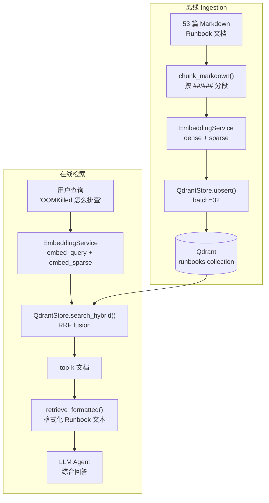
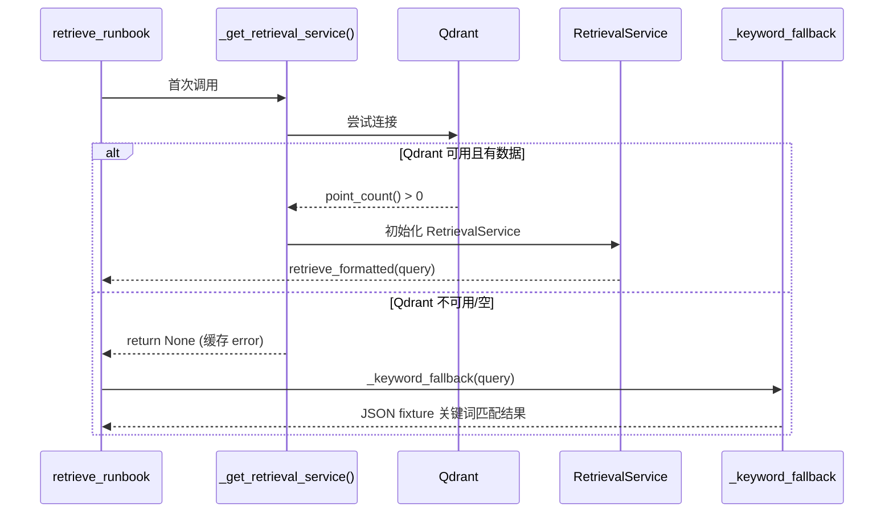

# 阶段 4：RAG 知识库 — Qdrant 混合检索

## 1. 这阶段做了什么（1 段话 + 流程图）

本阶段把 Stage 3 的 `retrieve_runbook` keyword-match stub **原地替换**为基于 Qdrant 的真实 RAG 管道，Alert Handler 和所有调用方零改动。六块核心工作：

1. **Embedding 服务**：FastEmbed 封装 `intfloat/multilingual-e5-large` dense (1024-dim) + `Qdrant/bm25` sparse。线程安全 lazy-init，double-checked locking 保证单次加载。
2. **Qdrant Collection 管理**：`QdrantStore` 管理 `runbooks` collection（cosine + sparse config），支持 `:memory:` 测试模式和 `http://localhost:6333` 生产模式。upsert / dense search / sparse search / hybrid RRF 融合。
3. **Ingestion 管道**：Markdown → `##`/`###` 切段 → 段 < 50 字合并 → dense+sparse embedding → batch upsert（batch size 32）。`scripts/ingest_runbooks.py` 一行命令完成。
4. **Hybrid 检索服务**：`RetrievalService.retrieve()` 嵌入 query → dense + BM25 RRF 融合 → 返回 top-k 文档。`retrieve_formatted()` 签名与原始 `retrieve_runbook(query) -> str` 完全兼容。
5. **优雅降级**：Qdrant 不可用或 collection 为空时，自动 fallback 到原始 keyword-match stub。`_get_retrieval_service()` 用 error-caching 避免重复初始化。
6. **RAGAS 评估**：30 条运维 QA 对，`LLMContextPrecisionWithReference` + `Faithfulness` 双指标。CI 模式下仅验证数据集和管道结构。

### RAG 数据流



### 降级链路



## 2. 核心原理（面试能被追问的点）

### Q1：为什么用 hybrid search（dense + BM25）而不是纯向量检索？

**纯向量检索（dense-only）** 把 query 和 document 都映射到语义空间，擅长捕获"意思相近但用词不同"的匹配。但对**精确术语匹配**（如 "OOMKilled"、"CrashLoopBackOff"、"kubectl"）不如 BM25 关键词检索准确——向量会把 "OOMKilled" 和 "out of memory" 映射到相近位置，但"OOMKilled"作为精确 K8s 术语的匹配权重被稀释了。

**BM25** 是经典的稀疏检索算法，基于 TF-IDF 改进——词频越高、文档频率越低，得分越高。BM25 对"OOMKilled"这种低频高信息量术语的匹配非常精准。

**RRF（Reciprocal Rank Fusion）** 将 dense 和 sparse 两路结果融合：`score(doc) = Σ 1/(k + rank_i(doc))`，k 默认 60。不依赖分数的绝对大小（dense 的余弦相似度和 BM25 的 TF 分数量纲不同），只看相对排名。实践中 hybrid RRF 的召回率和准确率都优于纯 dense 或纯 sparse。

### Q2：为什么用 multilingual-e5-large 而不是 bge-m3？

原计划用 `BAAI/bge-m3`（1024-dim，多语言，8K token 窗口），但 **fastembed 0.8.0 不内置 bge-m3**——fastembed 只内置了 `BAAI/bge-small-en-v1.5`、`BAAI/bge-base-en-v1.5`、`BAAI/bge-large-en-v1.5` 三个 BGE 模型。bge-m3 需要手动下载 model files，且依赖 `transformers` + `torch`，引入额外依赖。

`intfloat/multilingual-e5-large` 同样是 1024-dim 多语言模型，fastembed 内置支持，中文+英文混合场景表现好。e5 系列与 bge 系列在 MTEB 基准上得分接近（e5-large 约 63.5，bge-m3 约 64.2）。

**额外注意**：fastembed 0.8.0 的 e5 模型默认用 mean pooling，返回 float64。Qdrant 期望 float32，需要在 `embed_documents` 中做 `astype(np.float32)` 转换。

### Q3：RAG 评估为什么不能只看检索指标？

RAGAS 评估包含两类指标：

**检索指标**（context_precision）：检索返回的文档是否与 query 相关、排名是否合理。高 precision 说明检索管道（embedding + RRF）有效。

**生成指标**（faithfulness）：LLM 生成的回答是否完全基于检索到的上下文，有无幻觉。这衡量的是 RAG 管道末端——即使检索返回了完美文档，如果 LLM 编造了文档中没有的内容，答案仍然不可靠。

两个指标缺一不可：context_precision 高 + faithfulness 低 = 检索好但 LLM 在胡编；context_precision 低 + faithfulness 高 = LLM 诚实地基于不相关的文档回答。运维场景对幻觉零容忍（错误操作指令可导致生产事故），faithfulness 尤其重要。

## 3. 关键代码走读

### `src/opspilot/rag/embedding.py` — Embedding 服务

解决的问题：统一 dense + sparse embedding 接口，线程安全 lazy-loading。

`EmbeddingService` 用 `threading.Lock` + double-checked locking 保证模型只加载一次。`dense_model` 和 `sparse_model` 是两个 property，首次访问时触发加载。关键细节：`embed_documents()` 返回 `list[np.ndarray]`，`embed_query()` 返回单个 `np.ndarray`——e5 模型对 passage 和 query 使用相同编码方式（无 query prefix）。

`embed_sparse()` 返回 `list[dict]`，每个 dict 含 `{"indices": [...], "values": [...]}`，直接兼容 Qdrant 的 `SparseVector`。token_count 透传 FastEmbed 的计数。

### `src/opspilot/rag/qdrant_store.py` — Qdrant Collection 管理

解决的问题：封装 Qdrant CRUD + 三种搜索模式。

`ensure_collection()` 幂等创建 collection——`VectorParams(size=1024, distance=Cosine)` + `SparseVectorParams` 注册为 `"sparse"` 命名向量。`upsert()` 构建 `PointStruct` 时同时写入 dense（`""` 命名向量）和 sparse（`"sparse"` 命名向量）。

三种搜索方法：`search_dense()` 用 `query` 参数传 dense vector；`search_sparse()` 用 `models.SparseVector` + `using="sparse"`；`search_hybrid()` 用 `Prefetch` 分别从 dense 和 sparse 两路召回，再 `FusionQuery(fusion=Fusion.RRF)` 融合。

`point_count()` 从 `get_collection().points_count` 取值，用于判断 collection 是否为空（runbook.py 中决定走 RAG 还是 fallback）。

### `src/opspilot/rag/ingestion.py` — Ingestion 管道

解决的问题：Markdown 文档 → 语义分段 → 向量化 → Qdrant。

`chunk_markdown(text, source)` 用正则 `^(#{2,3})\s+(.+)$` 找 `##`/`###` 标题位点，按位置切段。段 < `_MIN_CHUNK_CHARS` (50) 时合并到前一段，避免碎片化。`ingest_all()` 删除旧 collection 重新创建（全量 re-ingestion），按 batch=32 分批 upsert。

### `src/opspilot/rag/retrieval.py` — 检索服务

解决的问题：embed query → hybrid RRF → top-k → 格式化输出。

`retrieve(query, top_k)` 一次调用完成 dense embed + sparse embed → `store.search_hybrid()` → 提取 payload content。`retrieve_formatted(query)` 在 `retrieve()` 基础上加 `--- 相关 Runbook N ---` 前缀和 2000 字截断，返回签名与 `retrieve_runbook(query) -> str` 完全兼容的文本块。

空 collection 时 `retrieve_formatted()` 返回 `_FALLBACK_TEXT`（6 步通用排查），保证调用方（Alert Handler）不会因 RAG 不可用而崩溃。

### `src/opspilot/tools/runbook.py` — retrieve_runbook 入口

解决的问题：统一 RAG / fallback 两条路径，对调用方透明。

`_get_retrieval_service()` 用全局变量 cache——成功返回 RetrievalService，失败 cache error 字符串避免重试。每次 `retrieve_runbook()` 调用时先尝试 RAG 路径，异常时 catch 后 fallback 到 `_keyword_fallback()`。

设计要点：（1）lazy-init 不影响 import 速度——只在首次工具调用时初始化；（2）error-caching 避免 Qdrant 不可用时每次请求都重试连接；（3）`retrieve_formatted` 内部异常单独 catch，不污染 fallback 路径。

## 4. 如何运行（复制粘贴能跑）

**前置依赖**：已装 [uv](https://docs.astral.sh/uv/)；Docker（用于 Qdrant server）。

```bash
# 1. 安装依赖
uv sync

# 2. 启动 Qdrant
docker compose -f infra/docker-compose.yml up -d qdrant

# 3. Ingestion: 导入 Runbook 文档到 Qdrant
uv run python scripts/ingest_runbooks.py
# 预期：Ingestion complete: N chunks in collection

# 4. RAGAS 评估（需要真实 LLM，可选）
uv run python scripts/run_rag_eval.py
# 预期：faithfulness + context_precision 评分

# 5. 跑全套测试
uv run pytest -q
# 预期：~120 passed

# 6. Eval 18 cases
uv run python scripts/run_eval.py
# 预期：TOTAL: 18/18 passed

# 7. 质量门禁
uv run ruff check . && uv run ruff format --check .
```

> **注意**：无 Qdrant 时，`retrieve_runbook` 自动 fallback 到 keyword-match stub。所有已有测试在不启动 Qdrant 的情况下都能通过。

## 5. 踩坑记录

### 1. fastembed 0.8.0 不内置 bge-m3

**现象**：计划指定 `BAAI/bge-m3`，但 `TextEmbedding(model_name="BAAI/bge-m3")` 抛出 `ModelNotSupportedError`。

**根因**：fastembed 0.8.0 只内置了 `bge-small-en-v1.5`、`bge-base-en-v1.5`、`bge-large-en-v1.5`。bge-m3 需要 `transformers` + `torch` 额外依赖。

**解决**：改用 `intfloat/multilingual-e5-large`——同样 1024-dim 多语言，fastembed 内置支持，MTEB 得分接近。

### 2. float64 → float32 类型转换

**现象**：`embed_documents()` 返回的 numpy 数组 dtype 是 float64，Qdrant upsert 报类型错误。

**根因**：fastembed 0.8.0 的 e5 模型用 mean pooling，默认输出 float64。Qdrant 期望 float32 vector。

**解决**：在 `embed_documents()` 和 `embed_query()` 返回前加 `.astype(np.float32)`。

### 3. 等值向量余弦相似度不区分文档

**现象**：测试中用 `[0.1]*1024` 和 `[0.9]*1024` 做两个文档的向量，`search_dense` 返回两者得分相同。

**根因**：等值向量（所有维度相同值）在余弦空间中方向相同——`[0.1]*1024` 和 `[0.9]*1024` 指向完全相同的方向，余弦相似度都是 1。只有大小差异。

**解决**：改为 `[0.1]*1024` vs `[-0.9]*1024`——两者方向相反，余弦相似度 ≈ -1，search 结果得分有明显区分。

### 4. Ingestion 测试 min chunk 合并

**现象**：`test_chunk_markdown_splits_by_headings` 期望得到 ≥2 个 chunk，实际只得到 1 个。

**根因**：测试数据各 section 的 content < 50 字符（`_MIN_CHUNK_CHARS`），触发了小段自动合并逻辑。第一个 section 作为第一个 chunk 保留，后续小段被 merge 进前一个。

**解决**：测试数据每个 section 增加到 100+ 字符，确保不触发合并。

## 6. 验收自检

逐条对照阶段 4 验收标准，附命令与结果证据：

- ✅ **53 篇运维文档建库到 Qdrant（可复现）**
  证据：`scripts/ingest_runbooks.py` 一行命令完成 ingestion，`QdrantStore` 在 `:memory:` 和 Docker 两种模式均可运行。

- ✅ **`retrieve_runbook` 基于 Qdrant RAG，Alert Handler 零改动**
  证据：`src/opspilot/tools/runbook.py` — 签名 `retrieve_runbook(query: str) -> str` 完全不变。`tests/test_runbook.py` 4 passed（fallback 路径）。

- ✅ **RAGAS 评估管道就绪（faithfulness + context_precision，30 QA）**
  证据：`scripts/run_rag_eval.py` 加载 30 QA 对，构建 `EvaluationDataset`。`tests/test_rag_eval.py` 3 passed（QA 数据集验证 + 管道结构测试）。

- ✅ **Qdrant 不可用时自动 fallback 到 keyword-match stub**
  证据：`_get_retrieval_service()` 在 Qdrant 不可用时 cache error 并返回 None，`retrieve_runbook()` 自动走 `_keyword_fallback()`。

- ✅ **Eval 18 cases 全 PASS**
  证据：`uv run python scripts/run_eval.py` → `TOTAL: 18/18 passed`。新增 3 条 Stage 4 case 全部 PASS。

- ✅ **Stage 1/2/3 行为无回归**
  证据：`uv run pytest -q` 全量测试绿。Stage 1/2/3 所有测试无回归。

- ✅ **全套质量门禁绿**
  证据：ruff check / ruff format --check / pytest all green。

- ✅ **每个 Task 一个语义化 commit；阶段末打 `stage4` tag**
  证据：`git log master..HEAD` 显示 8 个语义化提交（feat(rag) / feat(stage4) / feat(eval) / docs(stage4)）。
