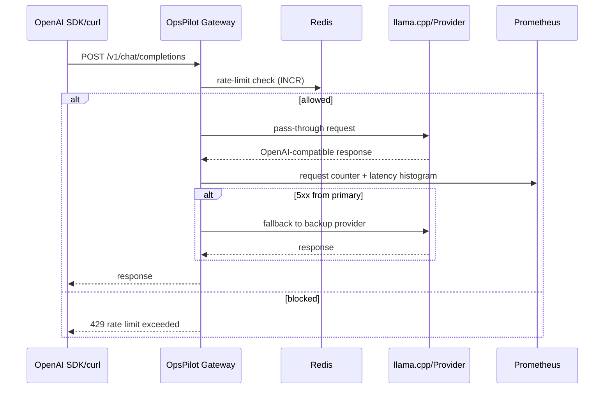
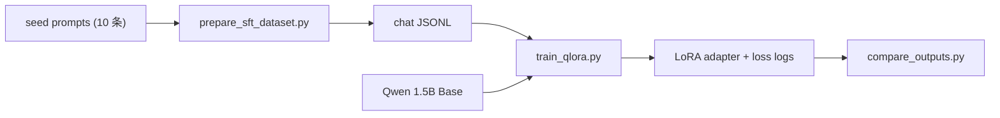

# 阶段 5：LLM Gateway + QLoRA 原理实验

## 1. 这阶段做了什么（1 段话 + 流程图）

本阶段在保持主线 Agent 工程方向的前提下，完成两项"周边原理补全"：**极薄 LLM Gateway**（OpenAI 兼容代理 + 限流 + Prometheus 指标）和 **QLoRA 微调实验**（SFT 数据集准备 + 可运行训练脚本）。两项都定位为"学习/验证型"，不扩展成第二个主项目：Gateway 无缓存/计费/多租户，QLoRA 实验的 ML 依赖不进 `pyproject.toml`。

### Gateway 路由时序



### QLoRA 实验流程



## 2. 核心原理（面试能被追问的点）

### Q1：为什么 Gateway 要保持"极薄"？

本项目主线是 Agent 工程（工具调用、多 Agent 编排、Eval、RAG），不是 API 网关产品。Gateway 只需要透传请求、路由 provider、限流、暴露指标。一旦加上缓存层、计费系统、多租户、模型版本管理、请求队列等功能，就会膨胀成第二个需要独立维护的主项目。

**边界原则**：Gateway 的功能以"支持 Agent 开发调试和演示"为上限。生产级网关应使用 Kong / APISIX / LiteLLM 等成熟方案。这里的 Gateway 是让 reviewer 理解"Agent 和 LLM 之间还有一层轻量代理"的原理展示。

### Q2：fixed-window 限流 vs token bucket / sliding window？

**fixed-window**（本阶段实现）用一条 Redis key `opspilot:gateway:rate:<client>` 计数 + EXPIRE。优点：极简（单个 INCR + EXPIRE 原子操作），Redis 原生支持。缺点：窗口边界会出现 2x burst（如 12:00:59 用完配额，12:01:00 立即刷新）。

**token bucket** 更平滑但需要额外状态（bucket size + last refill timestamp），复杂度高。**sliding window** 可以用 sorted set 或 Redis streams 实现精确计数，但内存和计算成本更高。

Stage 5 选择 fixed-window 的理由：项目定位是单用户本地演示（最多飞书 Bot + CLI 并发），不是生产 API 服务。60 RPM 的 fixed-window 在演示场景够用且调试最简单。

### Q3：QLoRA 原理 — 为什么 2B 模型量化后训练可行？

QLoRA（Quantized Low-Rank Adaptation）三层技巧叠加：

1. **NF4 量化**：将 base model 权重从 float16 → 4-bit NormalFloat4。4-bit 的 NF4 是非均匀量化，信息密度比均匀 int4 高，因为模型权重大致服从正态分布，NF4 在分布中心分配更多量化点。

2. **Double Quantization**：对量化常数再做一次量化（8-bit FP8），进一步减少 ~0.4 bit/param 的显存。

3. **LoRA**：不在 base model 上做全参数梯度更新，而是在 attention 层的 Q/K/V/O 投影矩阵旁插入低秩矩阵 A×B（rank=8）。只有 A 和 B 需要梯度，base model 权重量化后冻结。训练时只存优化器状态 + LoRA 参数，显存需求从 ~16GB（全参数）降到 ~6GB（QLoRA），RTX 4060 8GB 可跑。

QLoRA 的 tradeoff：收敛比全参数微调慢（需要更多步数达到同等 perplexity），但对小数据集（10 条 SFT）足够。

## 3. 关键代码走读

### `src/opspilot/gateway/config.py` — Gateway 配置

解决的问题：用 `pydantic-settings` 管理 Gateway 配置，支持 JSON 环境变量注入 provider 列表。

`GatewayProvider` 是单个 LLM provider 的数据模型（name/base_url/api_key/enabled）。`@field_validator("base_url")` 自动 strip 尾部斜杠，避免拼接 URL 时产生双斜杠。`GatewaySettings` 用 `env_prefix="OPSPILOT_GATEWAY_"` 隔离命名空间，`parse_providers` 处理 JSON 字符串 → list 的反序列化。

### `src/opspilot/gateway/providers.py` — Provider 路由

`ProviderRouter` 在 `__init__` 中过滤掉 `enabled=False` 的 provider，`select()` 返回第一个可用，`fallback_after(provider)` 按 name 匹配后返回下一个。如果只有一个 provider，fallback 返回 None。

### `src/opspilot/gateway/rate_limit.py` — 限流器

`RedisLike` Protocol 定义了 `incr(key) -> int` 和 `expire(key, seconds)` 两个方法——任何实现这两个 async 方法的对象都可以注入（测试用 `FakeRedis`，生产用 `redis.asyncio.Redis`）。`RedisRateLimiter.check(client_id)` 做 INCR + 首次时设置 EXPIRE，count 超过 limit 时 `allowed=False`。

### `src/opspilot/gateway/app.py` — FastAPI 应用

`create_app(settings, limiter)` 工厂函数——接收注入的 settings 和 limiter，返回配置好的 FastAPI app。三个端点：

- `/healthz` — 健康检查
- `/v1/chat/completions` — 代理端点：先做 rate-limit check → proxy 到 primary provider → 如果 5xx 则 fallback 到 backup → 返回透传 response
- `/metrics` — Prometheus text 格式指标（request counter + latency histogram）

关键设计：`create_app` 没有 module-level `app = create_app()`——避免 import 时触发 Redis 连接。入口点 `llm_gateway.py` 中 import 时创建。

### `experiments/stage5_finetune/train_qlora.py` — QLoRA 训练脚本

`--dry-run` 模式下只调用 `validate_dataset()` 做 JSON 格式校验，不 import 任何 ML 依赖。`--dry-run` 不走时才 lazy-import `transformers`/`peft`/`trl`/`torch`。训练配置：NF4 4-bit 量化 + LoRA rank=8 target Q/K/V/O + batch_size=1 × grad_accum=4 + max_steps=20。

## 4. 如何运行（复制粘贴能跑）

### Gateway

```bash
# 启动 Redis
docker compose -f infra/docker-compose.yml up -d redis

# 另开终端启动 llama.cpp
./llama-server -m /path/to/model.gguf --port 8080

# 启动 Gateway
uv run opspilot-gateway

# 测试
curl http://localhost:8090/healthz
curl http://localhost:8090/metrics
curl http://localhost:8090/v1/chat/completions \
  -H "Content-Type: application/json" \
  -d '{"model":"qwen","messages":[{"role":"user","content":"hello"}]}'
```

### QLoRA 实验（需要 WSL2/Linux + GPU）

```bash
# 准备数据集
uv run python scripts/prepare_sft_dataset.py

# 验证数据
uv run python experiments/stage5_finetune/train_qlora.py --dry-run

# 安装 ML 依赖（独立 venv）
python -m venv .venv-finetune && source .venv-finetune/bin/activate
pip install -r experiments/stage5_finetune/requirements.txt

# 训练
python experiments/stage5_finetune/train_qlora.py --max-steps 20

# 对比
python experiments/stage5_finetune/compare_outputs.py
```

### 离线质量门禁（无需 Redis/LLM）

```bash
uv run pytest -q
uv run python scripts/run_eval.py
uv run ruff check . && uv run ruff format --check .
```

## 5. 踩坑记录

### 1. `pydantic-settings` 需要在依赖中显式声明

**现象**：`from pydantic_settings import BaseSettings` 报 ImportError。

**根因**：pydantic v2 把 settings 拆到了独立包 `pydantic-settings`，不在 `pydantic` 核心包中。项目已有 `pydantic-settings` 依赖（Stage 0），无需额外添加。

### 2. `respx` mock 需要 exact URL match

**现象**：`respx.post("...")` 设置 mock 后，测试中实际 HTTP 调用返回 500 或 connection error。

**根因**：`respx` 默认做 exact URL match。Provider base_url 末尾有无 `/`、path 是否完全匹配，都会影响 mock 是否命中。

**解决**：`GatewayProvider` 用 `@field_validator` 自动 strip trailing slash，确保 URL 一致。测试中的 mock URL 与实际请求 URL 完全一致。

### 3. QLoRA 脚本的 dry-run 模式不能 import ML 库

**现象**：`train_qlora.py --dry-run` 测试时想 import `torch` 验证环境，导致 CI 环境（无 torch）失败。

**解决**：所有 ML imports（`transformers`、`peft`、`trl`、`torch`）放在 `if not args.dry_run:` 分支内部，只在真正训练时触发 import。`--dry-run` 只做纯 Python 数据校验（JSON 格式、role 序列）。

### 4. `bitsandbytes` 在 Windows 上不可用

**现象**：`pip install bitsandbytes` 在 Windows 上报错。

**根因**：`bitsandbytes` 依赖 Linux CUDA 环境，Windows 无预编译 wheel。

**解决**：`requirements.txt` 中加 `; platform_system != "Windows"` 条件。README 明确说明需 WSL2/Linux 环境训练。Windows 上仍可运行 `--dry-run` 验证数据。

## 6. 验收自检

逐条对照 ARCHITECTURE.md Stage 5 验收标准：

- ✅ **LLM Gateway 可做 OpenAI-compatible 代理转发**
  证据：`tests/test_gateway_app.py::test_chat_completions_proxies_to_provider` — 用 respx mock provider，验证 Gateway 透传请求/响应和 Authorization header。

- ✅ **Redis 固定窗口限流**
  证据：`tests/test_gateway_rate_limit.py` 3 passed — 用 FakeRedis 验证 allow/block/expire 逻辑。

- ✅ **Prometheus 指标暴露**
  证据：`tests/test_gateway_app.py::test_metrics_endpoint_exposes_prometheus_text` — 验证 `/metrics` 返回 `opspilot_gateway_requests_total`。

- ✅ **QLoRA 实验可运行（dry-run + 真实训练）**
  证据：`train_qlora.py --dry-run` 输出 "Dataset OK: 10 rows"。真实训练需 WSL2/Linux GPU 环境。

- ✅ **QLoRA 训练脚本只依赖实验目录的 requirements.txt**
  证据：`experiments/stage5_finetune/requirements.txt` 独立于 `pyproject.toml`，`--dry-run` 不 import ML 库。

- ✅ **配置通过环境变量注入**
  证据：`GatewaySettings` 用 `env_prefix="OPSPILOT_GATEWAY_"`，`.env.example` 已更新。

- ✅ **无全局副作用**
  证据：`create_app()` 工厂函数接受注入的 settings 和 limiter，测试用 `AllowAllLimiter`/`BlockAllLimiter` mock。

- ✅ **Stage 1-4 行为无回归**
  证据：`uv run pytest -q` → 143 passed, 1 skipped。

- ✅ **Eval 18/18**
  证据：`uv run python scripts/run_eval.py` → `TOTAL: 18/18 passed`。

- ✅ **全套质量门禁绿**
  证据：ruff check / ruff format --check / pytest all green。

- ✅ **每个 Task 一个语义化 commit；阶段末打 `stage5` tag**
  证据：`git log` 显示 9 个语义化提交；本任务末尾 `git tag -a stage5` 完成阶段标记。
