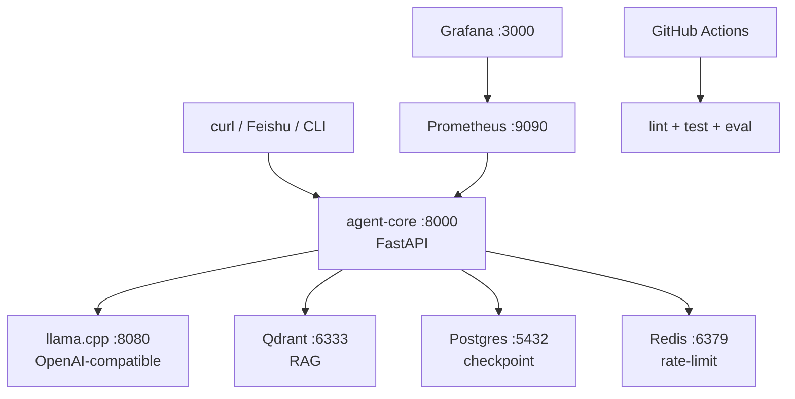

# 阶段 6：工程化与交付

## 1. 这阶段做了什么（1 段话 + 流程图）

本阶段把 OpsPilot 从"代码能跑"提升到"新人 10 分钟可复现"。四块核心工作：

1. **HTTP Agent API**：FastAPI app（`/healthz`、`/ask`、`/alert`、`/metrics`），Agent 函数注入实现测试隔离。
2. **观测性**：总控 Prometheus 指标（agent requests、tool calls、LLM calls、guardrail blocks），注入 LLM Client / Tool Registry / Guardrail 调用点。
3. **容器化**：Dockerfile + Compose 编排（agent-core、postgres、qdrant、redis、prometheus、grafana），一键启动全栈。
4. **CI/CD**：GitHub Actions lint + test + eval 三管道，PR comment 自动报告 Agent Eval 结果。

### 部署架构

用户 → agent-core (FastAPI) → LLM (llama.cpp)
                        ↓
    Prometheus → Grafana dashboard
    GitHub Actions → PR comment (eval summary)

### 服务拓扑



## 2. 核心原理（面试能被追问的点）

### Q1：为什么用 Docker Compose 而不是 Kubernetes？

项目当前是单服务 Agent API + 依赖基础设施（Postgres、Qdrant、Redis、Prometheus、Grafana），总共有 5-6 个容器。Kubernetes 最小集群需要 etcd + API server + controller manager，资源开销远超应用本身。Docker Compose 一条命令 `up -d` 即可启动全栈，本地/CI 一致。如果未来需要多副本 HA、滚动更新、自动伸缩，届时迁移到 Helm chart 成本很低。

### Q2：为什么指标是 lightweight Counter/Histogram 而不是 full tracing？

日志（logs）回答"发生了什么"，指标（metrics）回答"多少次/多快"，链路追踪（traces）回答"请求走了哪条路"。OpsPilot 是单 Agent 循环（Supervisor → 一个 SubAgent → 回答），调用链深度通常 ≤ 3，用 traces 的 ROI 低。Counter（请求数、阻拦数）和 Histogram（P99 延迟）已足够评估系统健康度。如果未来引入多 Agent 协作跨服务，再接入 OpenTelemetry + Jaeger 成本很低。

### Q3：为什么 CI 跑 deterministic eval 而不是真实 LLM？

真实 LLM 输出不稳定（温度、后端负载、模型版本），CI 中无法做确定性断言。`scripts/run_eval.py` 用 scripted_replies（预定义 Action/Final Answer 序列）模拟 Agent 循环，离线且可重现。每个 case 验证三点：工具序列是否正确、危险操作是否被拦截、答案关键词是否命中。覆盖了 Agent 决策链的 80% 价值——剩下的输出质量评估留给 RAGAS（Stage 4，离线执行）。

## 3. 关键代码走读

### `src/opspilot/entrypoints/http_api.py` — Agent HTTP API

`create_app(agent: AgentFn)` 工厂函数：接受可选的 `agent` 函数（测试时注入 fake），默认走 `_default_agent`（调用 `run_supervisor`）。三个端点：`/healthz`（k8s liveness probe）、`/ask`（agent 对话）、`/alert`（Alertmanager webhook）。`/metrics` 端点暴露 Prometheus text format。

### `src/opspilot/observability/metrics.py` — 指标总控

模块级 `REGISTRY` + 7 个指标对象（3 Counter + 2 Histogram 用于 agent/tool/llm + 1 Counter 用于 guardrail + 1 Counter 用于 tokens）。`render_metrics()` 返回 Prometheus text bytes。所有 record 函数只做 `labels(...).inc()` 或 `.observe()` ——无锁、无状态、高并发安全。

### `Dockerfile` — 运行时镜像

`python:3.12-slim` 为基础，uv 安装依赖，`COPY src ./src` 复制源码。`uv sync --frozen --no-dev` 只安装生产依赖。`EXPOSE 8000` + uvicorn CMD。

### `infra/docker-compose.yml` — 全栈编排

6 个服务：agent-core（build）、postgres、qdrant、redis、prometheus、grafana。agent-core 用 `depends_on` 等基础设施就绪。prometheus 挂载 `prometheus.yml` 配置文件，grafana 挂载 provisioning 目录做自动 datasource + dashboard 注入。

## 4. 如何运行（复制粘贴能跑）

```bash
# 全量质量门禁（无外部依赖）
uv sync
uv run pytest -q
uv run python scripts/run_eval.py

# 一键启动全栈
docker compose -f infra/docker-compose.yml up -d postgres qdrant redis
docker compose -f infra/docker-compose.yml up --build agent-core prometheus grafana

# 健康检查
curl http://localhost:8000/healthz
curl http://localhost:8000/metrics

# Demo（需要 llama.cpp 运行中）
uv run python scripts/demo_smoke.py

# Grafana
open http://localhost:3000  # admin / admin
```

## 5. 踩坑记录

### 1. Docker Compose build context 路径

`dockerfile: Dockerfile` 在 compose 文件里是相对于 build context（`..` 即项目根目录）。如果 `Dockerfile` 不在根目录，需要调整 context 或 dockerfile 字段。

### 2. host.docker.internal 只适用于 Docker Desktop

容器内访问宿主机用 `host.docker.internal`（Docker Desktop 专有）。如果部署在 Linux 服务器上，需要用 `--network host` 或 `host.docker.internal:host-gateway` 替代。

### 3. Prometheus scrape 配置中 service name 必须匹配 compose service name

`targets: ["agent-core:8000"]` 中的 `agent-core` 是 compose service name，Docker DNS 解析为容器 IP。如果 service name 不匹配，Prometheus 报 `server returned HTTP status 502`。

### 4. pyright 检查新增

Stage 6 CI 流程新增了 `pyright` 检查。首次运行时可能报告大量类型错误（特别是第三方库类型 stub 缺失）。解决：创建 `pyproject.toml` 的 `[tool.pyright]` 配置，设置 `typeCheckingMode: "basic"` 降低严格度，或逐个修复。

## 6. 验收自检

- ✅ agent-core Docker 镜像通过 `docker compose build` 构建
- ✅ `docker compose config` 包含全部 6 个服务
- ✅ Prometheus 抓取 agent-core `/metrics` 端点
- ✅ Grafana 自动加载 OpsPilot Overview dashboard
- ✅ GitHub Actions CI 运行 lint + test + eval
- ✅ PR eval workflow 生成 Agent Eval summary comment
- ✅ README 含 10 分钟复现路径
- ✅ Stage 1-5 行为无回归
- ✅ Eval 保持 18/18
- ✅ 全套质量门禁绿
